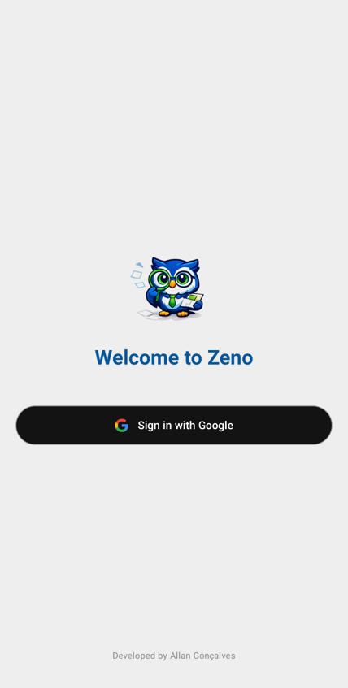
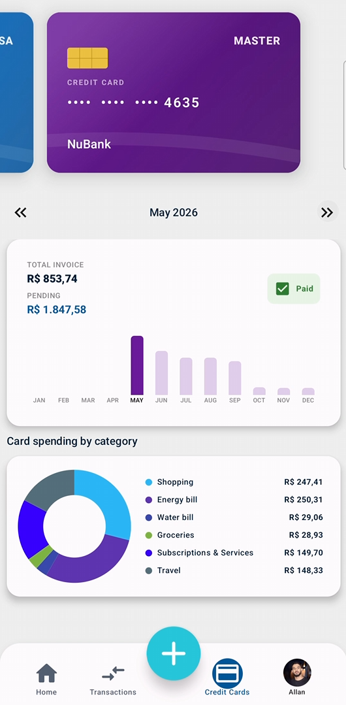

# 🦉 Zeno - Controle Financeiro

<table>
  <tr>
    <td></td>
    <td></td>
    <td></td>
  </tr>
</table>

Zeno é um aplicativo de gestão financeira pessoal moderno, desenvolvido para oferecer uma experiência fluida e segura. O projeto foca em alta performance, usabilidade e uma arquitetura robusta.

## 🚀 Funcionalidades

- **📊 Gestão de Transações**: Cadastro e acompanhamento detalhado de receitas e despesas.
- **💳 Gestão de Cartões de Crédito**: Controle de limites e faturas de forma integrada.
- **📅 Histórico Inteligente**: Fluxo financeiro organizado cronologicamente.
- **📈 Dashboard em Tempo Real**: Visualização clara do saldo atual e métricas financeiras.
- **🔐 Autenticação Segura**: Login via Google utilizando as APIs modernas de Credential Manager e Firebase Auth.
- **☁️ Cloud Sync**: Sincronização automática com Firebase Firestore para acesso em múltiplos dispositivos.
- **📴 Suporte Offline**: Estratégia Offline-first com Room, permitindo uso sem internet com sincronização posterior.
- **🌐 Internacionalização**: Suporte completo para Português (Brasil) e Inglês.

## 🧠 Tecnologias e Arquitetura

Este projeto utiliza as tecnologias mais modernas recomendadas pelo Google:

- **Jetpack Compose** → UI declarativa, reativa e totalmente baseada em componentes.
- **Hilt (DI)** → Injeção de dependência para um código desacoplado e testável.
- **Room** → Persistência de dados local com suporte a SQLite.
- **Firebase Auth** → Autenticação robusta e simplificada.
- **Firebase Firestore** → Banco de dados NoSQL em tempo real para sincronização cloud.
- **Kotlin Coroutines & Flow** → Gerenciamento de processos assíncronos e streams de dados reativos.
- **Navigation Compose** → Navegação baseada em rotas type-safe.

### 🏗️ Arquitetura

O projeto segue os princípios de **Clean Architecture** aliados ao padrão **MVVM (Model-View-ViewModel)**:

- **📦 data**: Implementações de persistência (Local via Room, Remote via Firestore) e repositórios.
- **📦 domain**: Modelos de negócio e casos de uso (Use Cases) que contêm a lógica central.
- **📦 presentation**: Camada de UI (Compose) e ViewModels para gestão de estado.
- **📦 di**: Módulos de configuração do Hilt.

✔ Separação clara de responsabilidades  
✔ Código escalável e testável  
✔ Fácil manutenção e evolução  

## ⚡ Destaques Técnicos

- **🔄 Sincronização Inteligente**: IDs baseados em UUID para evitar conflitos na sincronização entre local e nuvem.
- **🔥 Realtime Updates**: A interface reflete as mudanças do Firestore instantaneamente.
- **🧩 Componentização**: UI modularizada com componentes reutilizáveis e customizados.
- **🧼 Clean Code**: Segue rigorosamente os princípios de código limpo e boas práticas de desenvolvimento Android.

## 📦 Como rodar o projeto

1. **Clone o repositório:**
   ```bash
   git clone https://github.com/allangonc4lves/ControleFinanceiro.git
   ```
2. **Abra no Android Studio** (Ladybug ou superior recomendado).
3. **Configure o Firebase:**
   - Crie um projeto no [Console do Firebase](https://console.firebase.google.com/).
   - Ative: **Authentication** (Google Sign-In) e **Cloud Firestore**.
   - Baixe o arquivo `google-services.json` e coloque na pasta `/app`.
4. **Execute o app** em um emulador ou dispositivo físico.

## 🎯 Objetivo do Projeto

Este app foi desenvolvido como um portfólio técnico, com o objetivo de:
- Aplicar padrões de desenvolvimento Android moderno em um cenário real.
- Demonstrar domínio de arquitetura escalável e persistência de dados complexa.
- Simular um produto pronto para o mercado, com foco em UX e i18n.

---
**👨‍💻 Autor**  
Desenvolvido por **Allan Gonçalves** ([@allangonc4lves](https://github.com/allangonc4lves))
